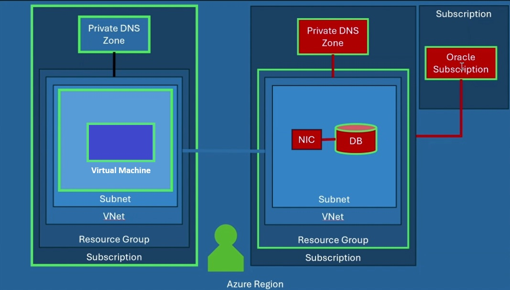
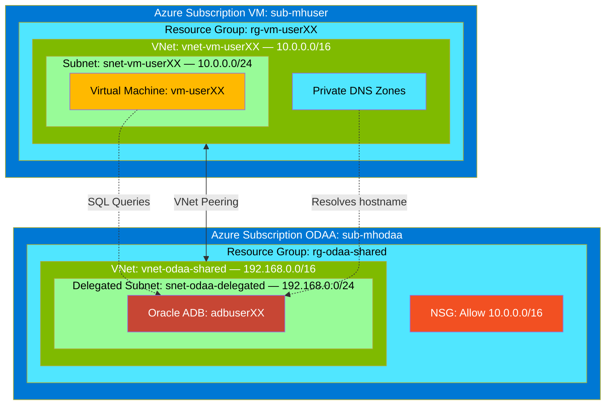
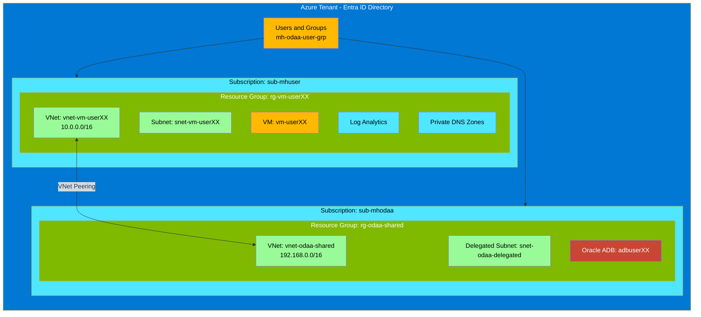
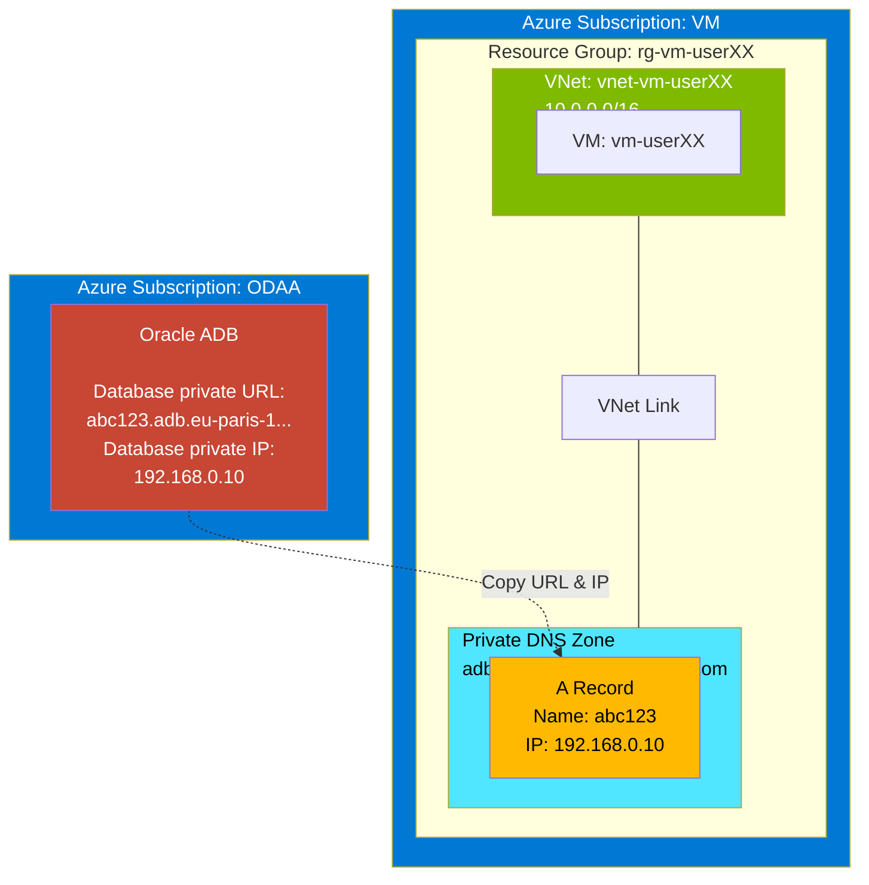



#  Microhack - Oracle Database @ Azure (ODAA)

##  Introduction

This intro-level microhack (hackathon) helps you gain hands-on experience with Oracle Database@Azure (ODAA).

### What is Oracle Database at Azure
Oracle Database@Azure (ODAA) is the joint Oracle–Microsoft managed service that delivers different Database services - see [ODAA deployed Azure regions](https://apexadb.oracle.com/ords/r/dbexpert/multicloud-capabilities/multicloud-regions?session=412943632928469) running on Oracle infrastructure colocated in Azure regions while exposing native Azure management, networking, billing, integration with Azure Key Vault, Entra ID or Azure Sentinel. This microhack targets the first-tier partner solution play focused on Autonomous Database because Microsoft designates ODAA as a strategic, co-sell priority workload; the exercises give partner architects the end-to-end skills—subscription linking, delegated networking, hybrid connectivity, and performance validation—needed to confidently deliver that priority scenario for customers with Oracle-related workloads in Azure.

### What You Will Learn in the MicroHack
You will learn how to create and configure an Autonomous Database Shared out of the offered Oracle Database@Azure services. How to deploy the Databases inside an Azure delegated subnet, update network security group (NSG) and DNS settings to enable connectivity from a simulated on-premises environment, and measure network performance to the Oracle Database instance. To make the microhack more realistic, we will deploy the Application layer (single Virtual Machine) and the Data layer (ODAA) in two different subscriptions to simulate a hub-and-spoke architecture. The following picture shows the high-level architecture of the microhack.



In an extended hackathon (not part of the following hackathon), we can integrate ODAA and their services into existing Azure native services like AKV, Azure EntraID, etc. and use GoldenGate for migrations to ODAA and integration into Azure Fabric. 


## What is VNet Peering?

In our deployed scenario, we created in advance a VNet peering between the Virtual Machine VNet and the ADB VNet, which is required so the Virtual Machine workloads can communicate privately and directly with the database.

### Architecture Diagram

#### Microhack with the adoption of an OD@A / ADB:

The following diagram shows how VNet peering connects the VM to the Oracle Autonomous Database:




### What does VNet peering mean in detail

| Concept | Description |
|---------|-------------|
| **VNet isolation by default** | The virtual machine is running in one VNet and ADB sits in another; without peering, those address spaces are completely isolated and the Virtual Machine cannot reach the database IPs at all. |
| **Private, internal traffic** | Peering lets both VNets exchange traffic over private IPs only, as if they were one network. No public IPs, no internet exposure, no extra gateways are needed. |
| **Low latency, high bandwidth path** | Application-database calls stay on the cloud backbone, which is crucial for chatty OLTP workloads and for predictable performance. |
| **Simple routing model** | With peering, standard system routes know how to reach the other VNet's CIDR; you avoid managing separate VPNs, user-defined routes, or NAT just to reach the DB instances. |
| **Granular security with NSGs** | Even with peering in place, NSGs on subnets/NICs still control which Virtual Machine subnets and ports (for example, 1521/2484) can reach the ADB database, giving you a simple but secure pattern. |

**In summary:** The peering is what turns two isolated networks (Virtual Machine and ADB) into a securely connected, private application-database path, which the scenario depends on for the workloads to function.

## Mapping between Azure and OCI

### Azure Resource Hierarchy Diagram

The following diagram shows how Azure organizes resources, mapped to our Terraform deployment:



> **Learn more:** [Azure resource organization](https://learn.microsoft.com/en-us/azure/cloud-adoption-framework/ready/azure-setup-guide/organize-resources)

### Comparison Table: Azure vs OCI

| Azure Concept | Description | OCI Equivalent |
|---------------|-------------|----------------|
| **Tenant** | Top-level identity boundary (Entra ID directory: users, groups, apps) | **Tenancy** (root container with identity domain/compartments) |
| **Subscription** | Billing + deployment boundary; holds resource groups and resources | **Tenancy + Compartments** with cost-tracking tags |
| **Resource Group** | Logical container for related resources; used for lifecycle, RBAC, policy, and tagging scope | **Compartment** (logical container for access control and organization) |
| **Region** | Geographic area containing one or more datacenters | **Region** |
| **Availability Zone** | Physically separate datacenter within a region | **Availability Domain** |

### Hierarchy Comparison

```
Azure:  Tenant --> Subscription --> Resource Group --> Resource
OCI:    Tenancy --> Compartment (nested) --> Resource
```

> **Note:** OCI compartments are closer to Azure resource groups + some subscription-scope concepts.

### Networking Concepts

| Azure | Description | OCI Equivalent |
|-------|-------------|----------------|
| **Virtual Network (VNet)** | A private network in Azure where you place resources (VMs, databases, etc.), similar to an on-premises LAN in the cloud | **Virtual Cloud Network (VCN)** |
| **Subnet** | A segment inside a VNet that groups resources and defines their IP range and routing boundaries | **Subnet** |
| **Network Security Group (NSG)** | A set of inbound/outbound rules that allow or block traffic to subnets or individual NICs, acting like a basic stateful firewall | **Security List / NSG** |
| **VNet Peering** | Connects two VNets so they can communicate using private IPs | **Local/Remote Peering** |

## Learning Objectives

- Understand how to onboard securely to Azure and prepare an account for Oracle Database@Azure administration.
- Learn the sequence for purchasing and linking an Oracle Database@Azure subscription with Oracle Cloud Infrastructure.
- Deploy an Autonomous Database inside an Azure network architecture and the required preparations.
- Apply required networking and DNS configurations to enable hybrid connectivity between an application deployed Virtual Machine and Oracle Database@Azure resources.
- Use the Virtual Machine to execute connectivity test and performance test against the deployed Oracle databases.

##  Prerequisites

You have two options to run this microhack:

1. **Local Setup:** Install the tools listed below on your laptop
2. **Zero-Install Option:** Use [Azure Cloud Shell](#azure-cloud-shell-alternative) (see tip below) — all tools are pre-installed

### Local Tools (if not using Cloud Shell)

- PowerShell Terminal
-  Install Azure CLI
- Install git and clone this repo by following the instructions in [Clone Partial Repository](docs/clone-partial-repo.md)

> [!TIP]
> **Bash Users:** This microhack uses **PowerShell** syntax mostly. Bash users need to consider the key differences between powershell vs bash. Following some examples:
> - Variable assignment: PowerShell `$var = "value"` → Bash `var="value"` (no spaces!)
> - Command substitution: PowerShell `$(...)` or `(...)` → Bash `$(...)`
> - Line continuation: PowerShell `` ` `` → Bash `\`


> [!TIP]
> <a id="azure-cloud-shell-alternative"></a>
> **Azure Cloud Shell Alternative:** You can run this entire microhack using [Azure Cloud Shell](https://shell.azure.com) without installing anything locally. Cloud Shell provides:
> - **Pre-installed tools:** Azure CLI, git, and PowerShell are already available
> - **Persistent storage:** Your files are saved in an Azure File Share across sessions
> - **Browser-based:** No local setup required—just sign in to the Azure Portal and click the Cloud Shell icon (>_)
>
> **To use Cloud Shell:**
> 1. Open https://shell.azure.com or click the **Cloud Shell** icon in the Azure Portal header
> 2. Select **PowerShell** as your shell environment
> 3. Clone this repo: `git clone --depth 1 --filter=blob:none --sparse https://github.com/cpinotossi/msftmh.git`
> 4. Navigate to the microhack folder: `cd msftmh/03-Azure/01-03-Infrastructure/10_Oracle_on_Azure`
>
> All commands in this microhack will work in Cloud Shell without modification.


##  Challenges
 
### Challenge 0: Set Up Your User Account

The goal is to ensure your Azure account is ready for administrative work in the remaining challenges.

> [!WARNING]
> **Before you begin — Ask your coach about a password or recommendation!**
> 
> The password you set for the Oracle Autonomous Database can be used in multiple challenges.
> 
> Using an incompatible password may cause deployment failures in later challenges.

> [!IMPORTANT] Before using the AZ command line in your preferred GUI or CLI, please make sure to log out of any previous session by running the command: 
>
>```powershell 
>az logout 
>```

You will receive a user and password for your account from your microhack coach. You must change this password during the initial registration.

Start by browsing to the Azure Portal https://portal.azure.com.

It is recommended to do the microhack in a **private browser session** or create your **own browser profile** to sign in with the credentials you received, and register multi-factor authentication. 

As a first check, you have to verify if the two resource groups for the hackathon are created via the Azure Portal https://portal.azure.com.

#### Actions

* Enable multi-factor authentication (MFA)
* Log in to the Azure portal with the assigned user
* Verify if the ODAA and VM resource groups including resources are available
* Verify the user's roles
  
#### Success Criteria

* Download the Microsoft Authenticator app on your mobile phone
* Enable MFA for a successful login
* Check if the resource groups for VM and ODAA are available and contain the resources via the Azure Portal https://portal.azure.com
* Check if the assigned user has the required roles in both resource groups.

#### Learning Resources

* [Sign in to the Azure portal](https://azure.microsoft.com/en-us/get-started/azure-portal)
* [Set up Microsoft Entra multi-factor authentication](https://learn.microsoft.com/azure/active-directory/authentication/howto-mfa-userdevicesettings)
* [Groups and roles in Azure](https://docs.oracle.com/en-us/iaas/Content/database-at-azure/oaagroupsroles.htm)

#### Solution

* Challenge 0: [Set Up Your User Account](./walkthrough/setup-user-account/setup-user-account.md)

### Challenge 1: Create an Oracle Database@Azure (ODAA) Subscription

> [!NOTE]
> **This is a theoretical challenge only.** No action is required from participants aside from reading the content. The ODAA subscription has already been created for you to save time.

Review the Oracle Database@Azure service offer, the required Azure resource providers, and the role of the OCI tenancy. By the end you should understand how an Azure subscription links to Oracle Cloud so database services can be created. Please consider that Challenge 1 is already realized for you to save time and is therefore a purely theoretical challenge.

#### Actions

* Move to the ODAA marketplace side. The purchasing is already done, but check out the implementation of ODAA on the Azure side.
* Check if the required Azure resource providers are enabled
  
#### Success Criteria

* Find the Oracle Database at Azure Service in the Azure Portal
* Make yourself familiar with the available services of ODAA and how to purchase ODAA

#### Learning Resources

* [ODAA in Azure an overview](https://www.oracle.com/cloud/azure/oracle-database-at-azure/)
* [Enhanced Networking for ODAA](https://learn.microsoft.com/en-us/azure/oracle/oracle-db/oracle-database-network-plan)

#### Solution

* Challenge 1: [Create an Oracle Database@Azure (ODAA) Subscription](./walkthrough/create-odaa-subscription/create-odaa-subscription.md)

### Challenge 2: Create an Oracle Database@Azure (ODAA) Autonomous Database (ADB)

Walk through the delegated subnet prerequisites, select the assigned resource group, and deploy the Autonomous Database with the standard parameters supplied in the guide. Completion is confirmed when the Oracle database shows a healthy state in the portal. 


In total we offer 4 types of Oracle database services in Azure. Information are available under the public link - [Region availability of ODAA](https://apexadb.oracle.com/ords/r/dbexpert/multicloud-capabilities/multicloud-regions?session=412943632928469)

For the microhack we are choosing Autonomous Database because it is a fully Oracle managed Service (PaaS).


#### Actions

* Verify that a delegated subnet of the upcoming ADB deployment is available.

In this microhack, you deploy the ADB via the **Azure portal**. For production environments, you can automate deployments using Infrastructure as Code (IaC):

| Tool | Description | Resources |
|------|-------------|-----------|
| **Terraform/OpenTofu** | Use the AzAPI or AzureRM provider to provision Oracle Database@Azure resources | [Terraform examples for ADB](https://learn.microsoft.com/en-us/azure/oracle/oracle-db/oracle-database-examples-autonomous-database-services), [OCI Landing Zones](https://github.com/oci-landing-zones/terraform-oci-multicloud-azure) |
| **Azure CLI** | Manage ODAA resources via `az oracle-database` commands | [Azure CLI for Oracle DB](https://learn.microsoft.com/en-us/cli/azure/oracle-database) |
| **Bicep/ARM** | Deploy using Azure Resource Manager templates with the `Oracle.Database` resource provider | [Azure Verified Modules](https://aka.ms/avm) |

> [!IMPORTANT]
>
> Setup the ADB exactly with the following settings:
>
> **ADB Deployment Settings:**
> 1. Workload type: **Transaction Processing**
> 2. Database version: **26ai**
> 3. ECPU Count: **2**
> 4. Compute auto scaling: **off**
> 5. Storage: **20 GB**
> 6. Storage autoscaling: **off**
> 7. Backup retention period in days: **1 day**
> 8. Administrator password: (do not use '!' inside your password)
> 9. License type: **License included**
> 10. Oracle database edition: **Enterprise Edition**


Optional: After you started the ADB deployment please clone the Github repository. Instructions are listed in the challenge 2 at the end of the ADB deployment section - see **IMPORTANT: While you are waiting for the ADB creation**

#### Success Criteria

* Delegated Subnet is available
* ADB Shared and/or Based Database is successfully deployed

#### Learning Resources

* [How to provision an Oracle ADB in Azure](https://learn.microsoft.com/en-us/azure/oracle/oracle-db/oracle-database-provision-autonomous-database)
* [Deploy an ADB in Azure](https://docs.oracle.com/en/solutions/deploy-autonomous-database-db-at-azure/index.html)
* [Provision Exadata Infrastructure in Azure](https://learn.microsoft.com/en-us/azure/oracle/oracle-db/exadata-provision-infrastructure)


#### Solution

* Challenge 2: [Create an Oracle Database@Azure (ODAA) Autonomous Database (ADB)](./walkthrough/create-odaa-adb/create-odaa-adb.md)

### Challenge 3: Update NSG and DNS to connect the Oracle ADB 

Although VNet peering connects the Virtual Machine and ODAA networks, two additional configurations are required before Virtual Machine can reach the database:

1. **NSG (Security):** The Oracle-managed NSG on the delegated subnet blocks all ingress by default. You must add an inbound rule that allows traffic from the Virtual Machine CIDR (`10.0.0.0/16`).

2. **Private DNS (Name Resolution) for ADB:** The ADB's private FQDN (e.g., `abc123.adb.eu-paris-1.oraclecloud.com`) is not automatically resolvable from Azure. You must create a Private DNS Zone matching the Oracle domain and add an A record pointing the hostname to the ADB's private IP.

Once all are in place, the VM can resolve the database hostname(s) and its TCP connections are permitted through the NSG.

#### Actions

* **NSG:** Add an inbound security rule in the OCI console to allow the Virtual Machine CIDR (`10.0.0.0/16`).
* **DNS:** Copy the "Database private URL" and "Database private IP" from the Azure Portal, then create an A record in the corresponding Azure Private DNS Zone linked to the Virtual Machine VNet.

#### DNS Configuration Diagrams

##### ADB DNS Configuration

The following diagram shows how Private DNS enables the VM to resolve the Oracle ADB hostname:



**Steps**

1. **Copy** the Database private URL and IP from the Azure Portal (ODAA ADB resource)
2. **Create** a Private DNS Zone (e.g., `adb.eu-paris-1.oraclecloud.com`) and add an A record with the hostname pointing to the private IP
3. **Link** the Private DNS Zone to the VM VNet so the VM can resolve the ADB FQDN


#### Success Criteria

* Set the NSG of the CIDR on the OCI side, to allow ingress from the VM to the ADB
* DNS is set up correctly for ADB (manual A record)

> [!CAUTION]
> **Without a working DNS the next Challenge will fail.** Make sure DNS resolution is properly configured before proceeding.

#### Learning Resources

* [Network security groups overview](https://learn.microsoft.com/azure/virtual-network/network-security-groups-overview),
* [Private DNS zones in Azure](https://learn.microsoft.com/azure/dns/private-dns-privatednszone), 
* [Oracle Database@Azure networking guidance](https://docs.oracle.com/en-us/iaas/Content/database-at-azure/network.htm)
* [Oracle Database@Azure DNS configuration](https://docs.oracle.com/en-us/iaas/Content/database-at-azure/network-dns.htm)
* [Oracle Database@Azure Delegated Subnet Design](https://docs.oracle.com/en-us/iaas/Content/database-at-azure/network-delegated-subnet-design.htm)

#### Solution

* Challenge 3: [Update the Oracle ADB NSG and DNS](./walkthrough/update-odaa-adb-nsg-dns/update-odaa-adb-nsg-dns.md)


---

### Challenge 4: Measure Network Performance to Your Oracle Database@Azure Autonomous Database

Use the deployed tools on the Virtual Machine to connect to the ADB instance. For the SQL latency test use the recommended tools

1. connping
2. adbping

and collect the round-trip results. Optionally supplement the findings with the lightweight TCP probe to observe connection setup timing.

#### Actions
* Log in to the Virtual Machine and execute a first performance test against the deployed ADB.

#### Success Criteria
* Successful login to the ADB via the instant client / SQL Plus
* Successful execution of the available performance tools

#### Learning Resources
* [Connect to Oracle Database@Azure using SQL*Plus](https://docs.oracle.com/en-us/iaas/autonomous-database-serverless/doc/connect-sqlplus-tls.html), 
* [Diagnose metrics and logs for Oracle Database@Azure](https://learn.microsoft.com/en-us/azure/cloud-adoption-framework/scenarios/oracle-on-azure/oracle-manage-monitor-oracle-database-azure)

#### Solution
* Challenge 4: [Measure Network Performance to Your Oracle Database@Azure Autonomous Database](./walkthrough/perf-test-odaa-adb/perf-test-odaa-adb.md)


<!-- -  Challenge 4: **[Do performance test from inside the AKS cluster against the Oracle ADB instance](./walkthrough/c3-perf-test-odaa.md)**
-  Challenge 5: **[Review data replication via Beaver](./walkthrough/c5-beaver-odaa.md)**
-  Challenge 6: **[Setup High Availability for Oracle ADB](./walkthrough/c6-ha-oracle-adb.md)**
-  Challenge 7: **[(Optional) Use Estate Explorer to visualize the Oracle ADB instance](./walkthrough/c7-estate-explorer-odaa.md)**
-  Challenge 8: **[(Optional) Use Azure Data Fabric with Oracle ADB](./walkthrough/c8-azure-data-fabric-odaa.md)** -->
 
## Contributors

*To be added*

