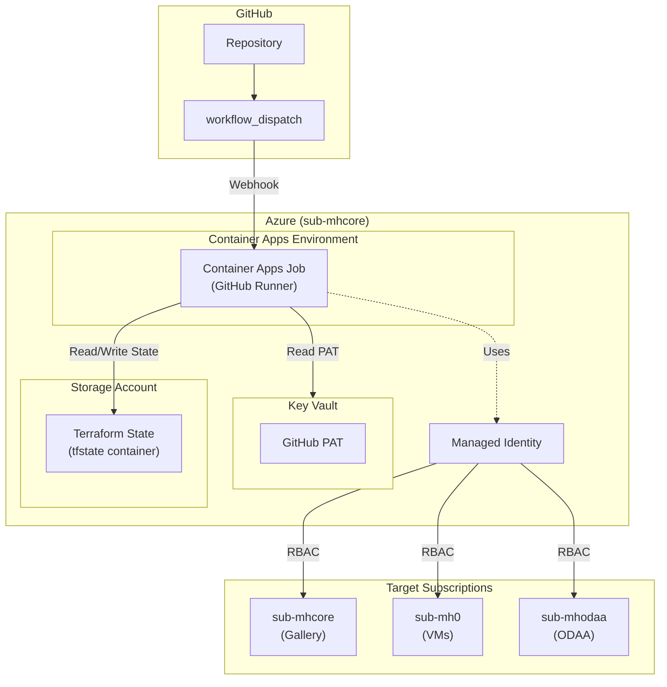

# GitHub Actions Self-Hosted Runner on Azure Container Apps

This Terraform module deploys a self-hosted GitHub Actions runner infrastructure on Azure Container Apps. The runner automatically scales from 0 to N based on workflow triggers, providing cost-effective CI/CD for the Oracle on Azure workshop.

## Architecture



## Features

- **Scale to Zero**: No cost when no workflows are running
- **Managed Identity**: No Azure secrets stored in GitHub
- **Secure PAT Storage**: GitHub PAT stored in Azure Key Vault
- **Remote State**: Terraform state stored in Azure Blob Storage
- **Automatic Scaling**: KEDA scales runners based on workflow queue

## Prerequisites

1. **Azure Subscriptions**: Access to all three workshop subscriptions
2. **Service Principal**: For initial deployment (same as workshop deployment)
3. **GitHub PAT**: With required scopes

## Setup Instructions

### Step 1: Create GitHub Personal Access Token

1. Go to [GitHub Settings → Tokens](https://github.com/settings/tokens)
2. Click "Generate new token (classic)"
3. Set expiration (recommend 1 year)
4. Select scopes:
   - `repo` - Full control of repositories
   - `workflow` - Update GitHub Action workflows
   - `admin:org` - Only if using organization-level runner
5. Copy the token (starts with `ghp_`)

### Step 2: Configure Terraform Variables

```powershell
cd github-runner
cp terraform.tfvars.example terraform.tfvars
```

Edit `terraform.tfvars`:

```hcl
# Azure Authentication (same as workshop)
tenant_id     = "f71980b2-590a-4de9-90d5-6fbc867da951"
client_id     = "8a9f736e-4eb2-4484-ae90-2493f57102b3"
client_secret = "your-client-secret"

# Subscription Configuration (for RBAC assignments)
# sub-mhcore - Runner wird hier deployed
sub_mhcore_id  = "09808f31-065f-4231-914d-776c2d6bbe34"
# sub-mh0 - Workshop VMs, VNets
sub_mh0_id     = "556f9b63-ebc9-4c7e-8437-9a05aa8cdb25"
# sub-mhodaa - ODAA VNets, User RGs
sub_mhodaa_id  = "4aecf0e8-2fe2-4187-bc93-0356bd2676f5"

# GitHub Configuration
github_pat          = "ghp_xxxxxxxxxxxx"
github_owner        = "your-org-or-username"  # e.g., "cpinotossi"
github_repo         = "your-repo-name"        # e.g., "msftmh"
github_runner_scope = "repo"                  # "repo" or "org"
```

### Step 3: Deploy the Runner Infrastructure

```bash
cd github-runner

# Initialize Terraform
terraform init
terraform plan -out=tfplan
terraform apply tfplan
```

### Step 4: Configure GitHub Repository Variables

After deployment, get the output values:

```bash
terraform output workflow_env_vars
```

In your GitHub repository:
1. Go to **Settings → Secrets and variables → Actions**
2. Click **Variables** tab
3. Add the following repository variables:

| Variable Name | Value |
|--------------|-------|
| `TF_STATE_STORAGE` | Storage account name from output |
| `TF_STATE_CONTAINER` | `tfstate` |
| `TF_STATE_RG` | `rg-github-runner` |

### Step 5: Test the Workflows

1. Go to **Actions** tab in your repository
2. Select **Deploy Oracle Workshop**
3. Click **Run workflow**
4. Enter user count (e.g., `3`)
5. Click **Run workflow**

## Terraform Outputs

| Output | Description |
|--------|-------------|
| `runner_resource_group` | Resource group name |
| `container_app_environment` | Container Apps Environment name |
| `container_app_job` | Container Apps Job name |
| `managed_identity` | Managed Identity details (client_id, principal_id) |
| `key_vault_name` | Key Vault containing GitHub PAT |
| `terraform_state_storage` | Storage account for Terraform state |
| `workflow_env_vars` | Environment variables for GitHub workflows |

## Cost Estimation

| Resource | Cost (approx.) |
|----------|----------------|
| Container Apps Job | ~€0.05 per job execution |
| Key Vault | ~€0.03/10k operations |
| Storage Account | ~€0.02/GB/month |
| Log Analytics | ~€2.76/GB ingested |

**Total**: Approximately €5-10/month with moderate usage.

## Troubleshooting

### Runner Not Scaling

1. Check Container Apps Job logs:
   ```bash
   az containerapp job logs show \
     --name github-runner \
     --resource-group rg-github-runner
   ```

2. Verify GitHub PAT is valid:
   ```bash
   az keyvault secret show \
     --vault-name <key-vault-name> \
     --name github-pat
   ```

### Terraform State Issues

1. Check storage account access:
   ```bash
   az storage blob list \
     --account-name <storage-account> \
     --container-name tfstate \
     --auth-mode login
   ```

### RBAC Issues

Verify Managed Identity has correct permissions:
```bash
az role assignment list \
  --assignee <managed-identity-principal-id> \
  --output table
```

## Security Considerations

1. **GitHub PAT**: Stored in Key Vault, accessed only by Managed Identity
2. **No Secrets in GitHub**: Azure authentication via Managed Identity
3. **Terraform State**: Encrypted at rest in Azure Storage
4. **Network**: Container Apps can be deployed in VNet for additional isolation

## Cleanup

To remove the runner infrastructure:

```bash
cd github-runner
terraform destroy
```

**Note**: This will also remove the Terraform state storage. Make sure to backup or migrate state before destroying.
