#  Challenge: Create Azure ODAA [Oracle Database@Azure] Base Database Resources

[Back to workspace README](../../README.md)

1. Registration of the Azure resource provider in Azure. In our case they are already deployed but can be checked if they are registered - see [Oracle Documentation: Oracle Database at Azure Network Enhancements](https://learn.microsoft.com/en-us/azure/oracle/oracle-db/oracle-database-network-plan)
2. Check the availability of a VNet and delegated subnet for the deployment of the database.
3. Deploy an Oracle BaseDB in Azure.
   1. Important: Choose the region FRANCE CENTRAL
   2. Use in the Networking section Managed private virtual network IP only
4. Furthermore, you will deploy in this chapter a BaseDB database via the Azure Portal.
5. Finally, check if the existing VNet peering between the AKS and database subscriptions is available and correctly configured.

## 🛰 Delegated Subnet Design (Prerequisites)

- ODAA Autonomous Database can be deployed within Azure Virtual Networks, in delegated subnets that are delegated to Oracle Database@Azure.
- Client subnet CIDR falls in general between /27 and /22 (inclusive).
- Valid ranges must use private IPv4 addresses and must avoid the reserved 100.106.0.0/16 and 100.107.0.0/16 blocks used for the interconnect.

A more detailed description can be found here: [Oracle Documentation: Oracle's delegated subnet guidance](https://docs.oracle.com/en-us/iaas/Content/database-at-azure/network-delegated-subnet-design.htm)

**NOTE**: For this Microhack, we have already created the corresponding VNets and subnets, so no additional action is required in this step.

##  What is an Azure Delegated Subnet?

Azure delegated subnets allow you to delegate exclusive control of a subnet within your VNet to a specific Azure service. When you delegate a subnet, the service can deploy and manage its own network resources (NICs, endpoints, routing) within that subnet without requiring you to provision each resource manually. Traffic still flows privately over your VNet, and you remain in control of higher-level constructs like NSGs and route tables.

## Verify if the Delegated Subnet is Available for ODAA

The delegated subnet is part of the VNet inside your ODAA subscription.

### Log in to the Azure Portal
[Azure portal](https://portal.azure.com).

## Search for Resource Groups "rg-odaa-shared"
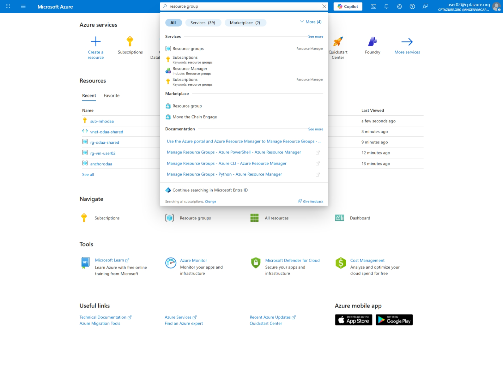

### Click on virtual Network Resource "vnet-odaa-shared"
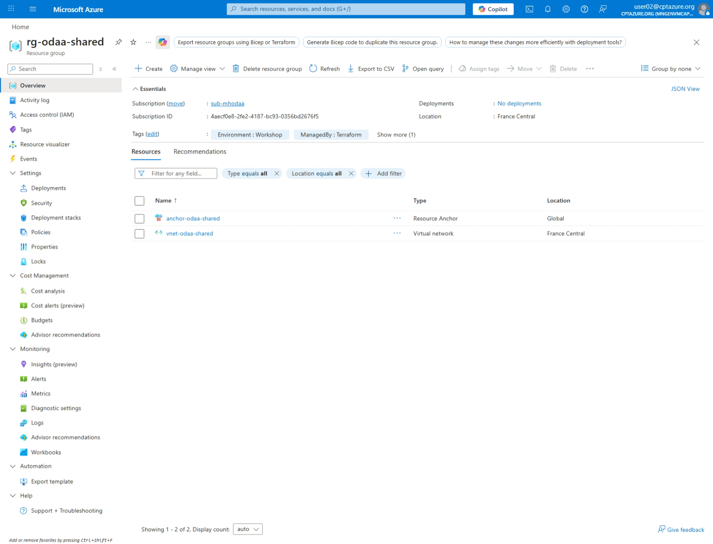

### In the VNet overview
You find under the sub-menu Settings the menu Subnets. In the menu Subnets, you see the subnet and inside the table the delegation for "Oracle.Database/networkAttachments".
   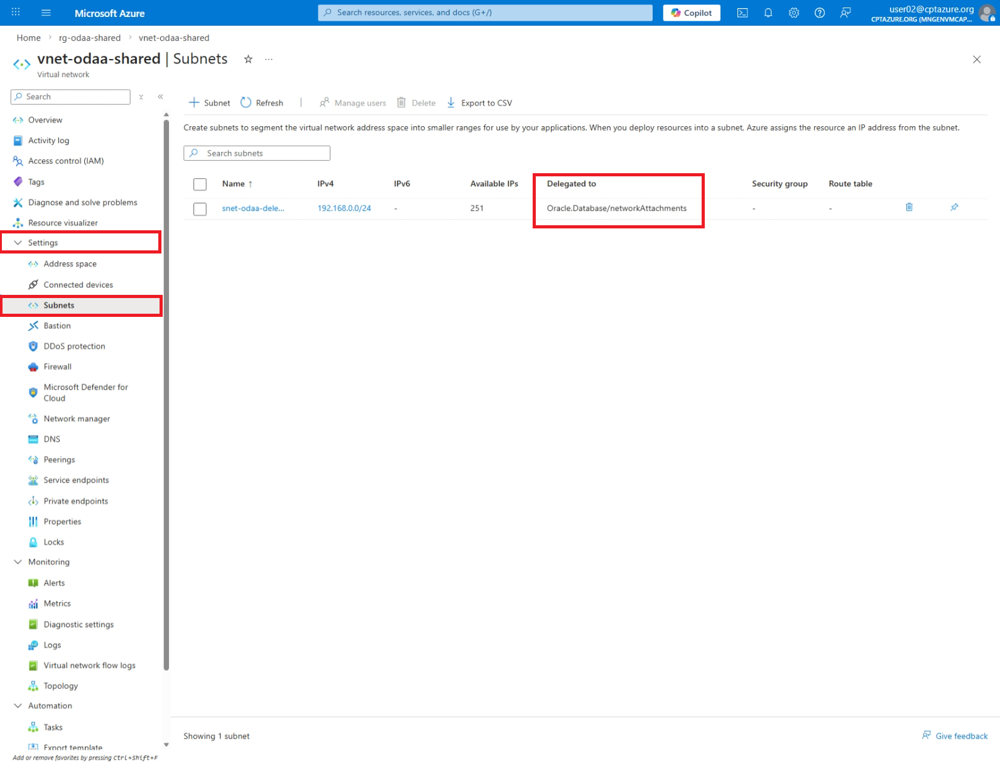

##  Create an ODAA Base Database Instance

### In the Azure portal, search for Oracle Services and select **Oracle Database@Azure**. 
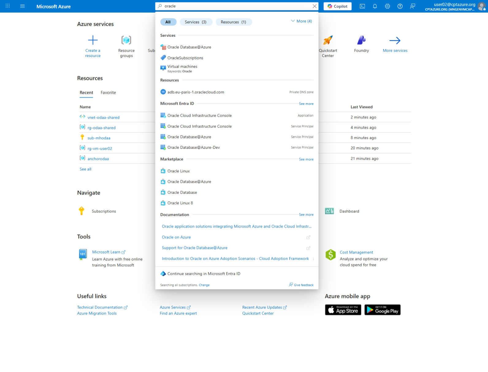

### Create Network Anchor

Select "Multicloud Resources", select Tab "Network Anchors" and select "Create".
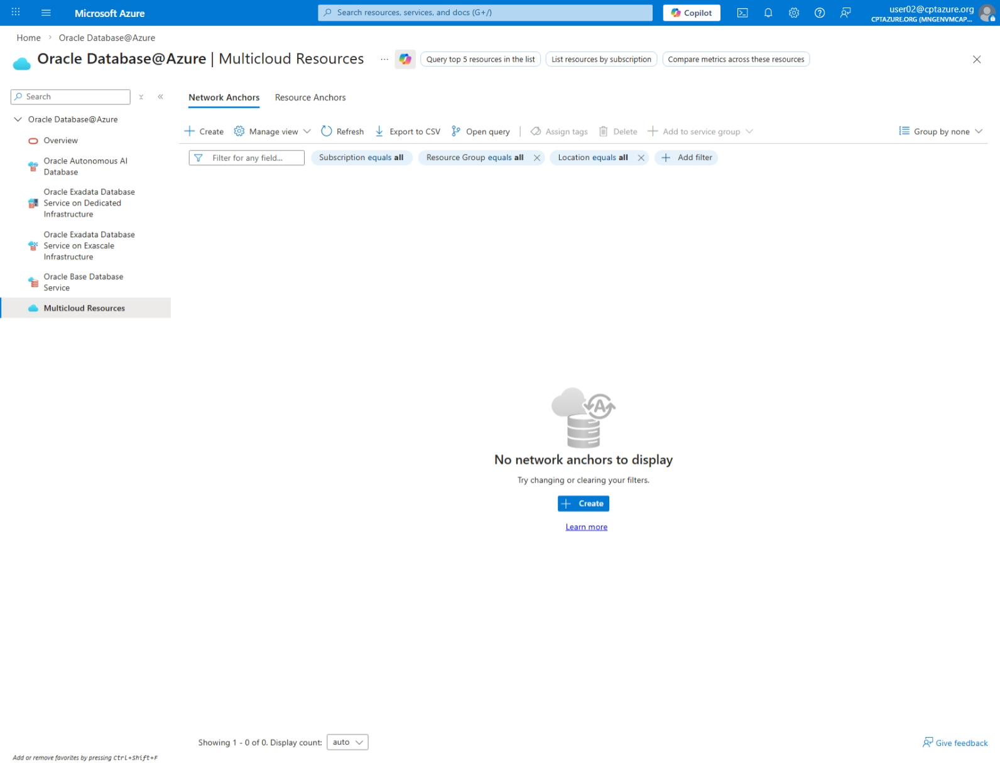

### Basic Tab

***Project Details***

| Field | Value | Description |
|-------|-------|-------------|
| **Subscription** | `sub-mhodaa` | Select your ODAA subscription |
| **Resource group** | `rg-odaa-shared` | Select or create a shared resource group for ODAA resources |

***Network Anchor Configuration***

| Field | Value | Description |
|-------|-------|-------------|
| **Name** | `nw-anchor-user<USER-NUMBER>` | Unique name for the network anchor (e.g., `nw-anchor-user<USER-NUMBER>`) |
| **Region** | `France Central` | Azure region matching your ODAA infrastructure |
| **Availability zone** | `Zone 1` | Select the availability zone for the anchor |
| **Resource Anchor** | `anchor-odaa-shared` | Reference to the shared ODAA resource anchor |
| **Virtual network** | `vnet-odaa-shared` | VNet where ODAA will be deployed |
| **Delegated Subnet** | `snet-odaa-delegated` | Subnet delegated to Oracle.Database/networkAttachments |
| **Backup subnet CIDR** | *(leave empty)* | Optional - CIDR for backup subnet if needed |

***DNS Configuration***

| Field | Value | Description |
|-------|-------|-------------|
| **Create DNS Listening Endpoint** | ☑ Enabled | Creates a DNS listener for name resolution |
| **Replicate DNS Private zones during DB creation** | ☐ Disabled | Only enable if you need DNS zone replication |
| **CIDR** | `10.0.0.0/8` | IP range for DNS resolution (must cover your VNet) |
| **Create DNS Forwarding Endpoint** | ☑ Enabled | Enables DNS forwarding to Azure DNS |

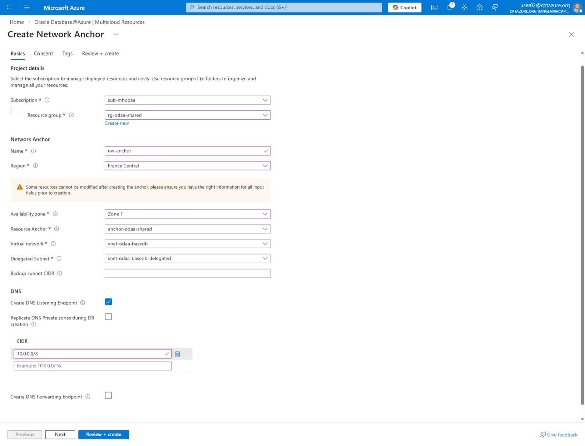

### Consent Tab

Agree to the terms and conditions

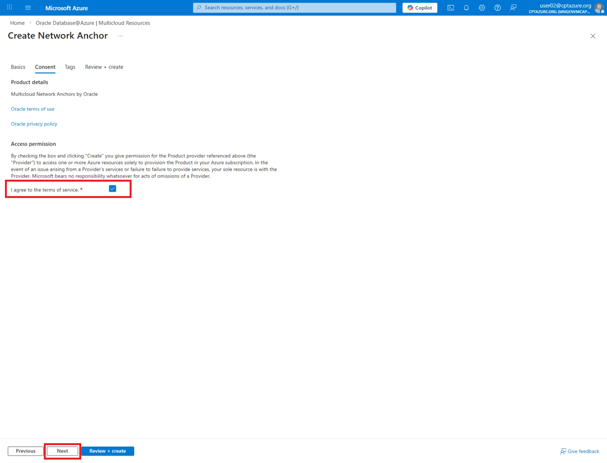

### Tags Tab

Keep it as it is.

### Review + Create Tab

Review the configuration and click "Create" to deploy the network anchor.

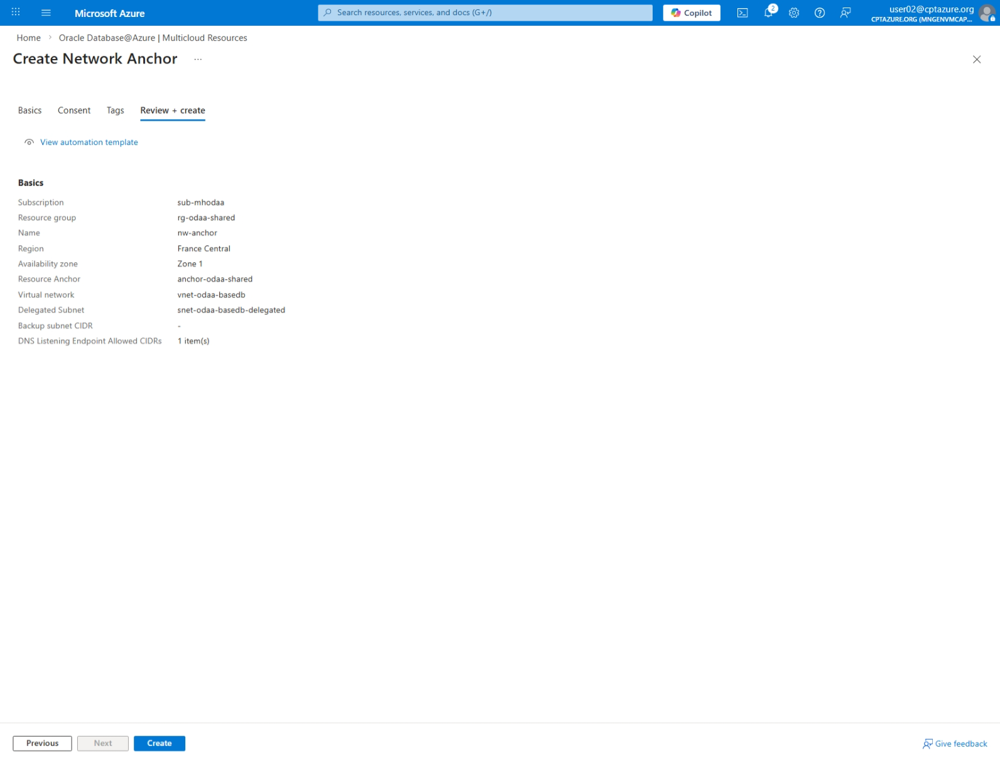

### Deployment finished

The deployment will take between 10 to 15 minutes.

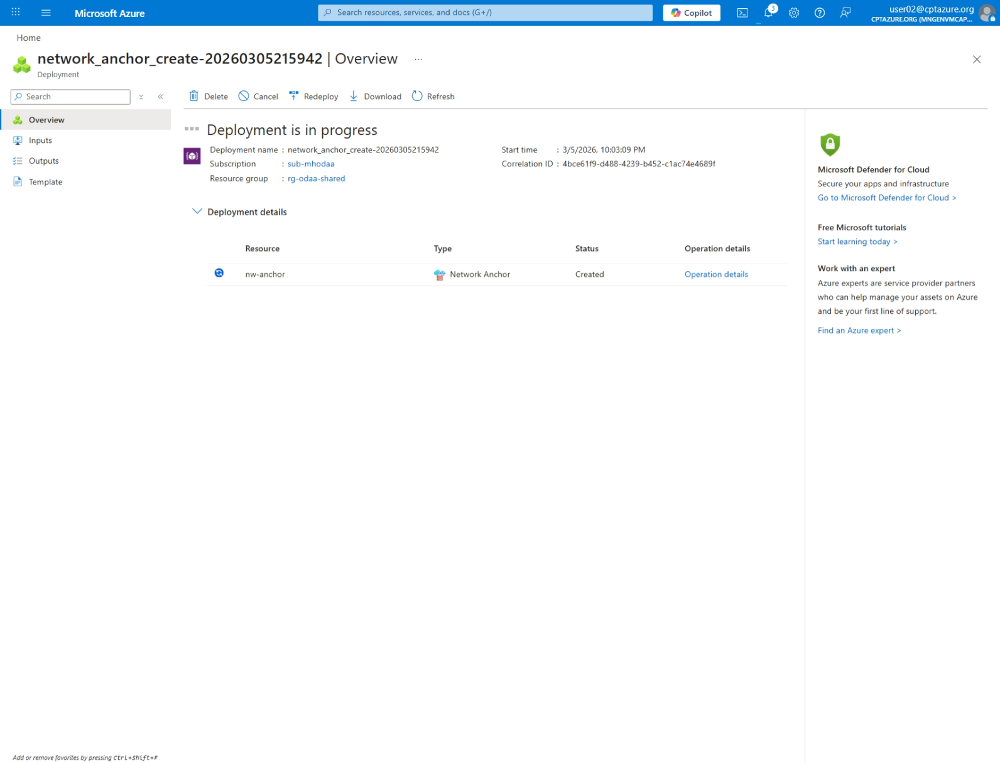

After the deployment is finished, click the blue button "go to resource".

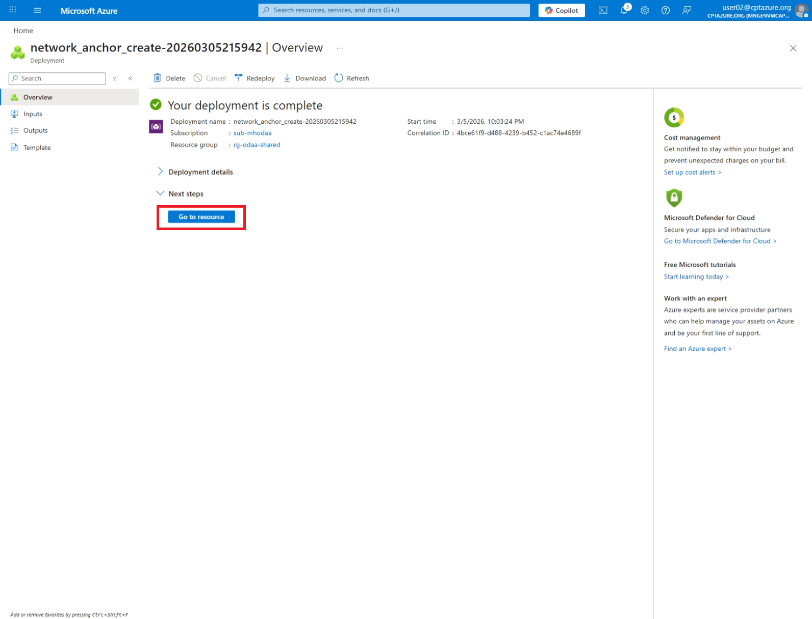

Inside the resource group select your newly created  network anchor.

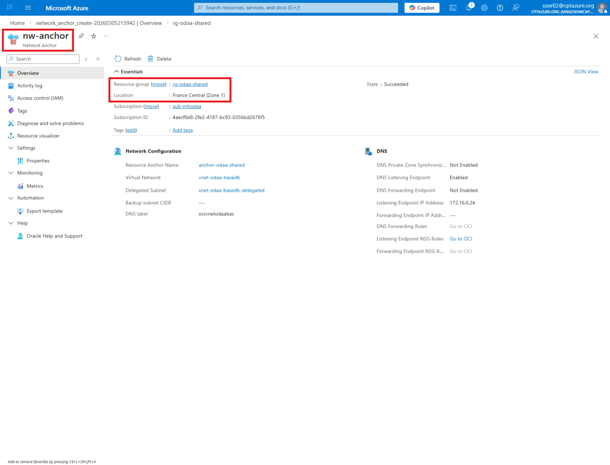

~~~powershell
az config set extension.dynamic_install_allow_preview=true
az oracle-database resource-anchor list -g anchorodaa 
$anchoreId=az oracle-database resource-anchor show -g anchorodaa -n anchorodaa --query id -o tsv
$subnetId=az network vnet subnet show -g rg-odaa-user02 -n snet-odaa-user02 --vnet-name vnet-odaa-user02 --query id -o tsv
~~~

~~~json
[
  {
    "id": "/subscriptions/4aecf0e8-2fe2-4187-bc93-0356bd2676f5/resourceGroups/anchorodaa/providers/Oracle.Database/resourceAnchors/anchorodaa",
    "location": "global",
    "name": "anchorodaa",
    "properties": {
      "linkedCompartmentId": "ocid1.compartment.oc1..aaaaaaaaxgykufgf2vzjdygpwrqvhms34gl2mjrio2gtxspbdz2s56rityga",
      "provisioningState": "Succeeded"
    },
    "resourceGroup": "anchorodaa",
    "systemData": {
      "createdAt": "2026-03-05T11:54:01.4265491Z",
      "createdBy": "ga1@cptazure.org",
      "createdByType": "User",
      "lastModifiedAt": "2026-03-05T11:54:45.8531673Z",
      "lastModifiedBy": "a50e6610-5416-4c2a-88b6-172c7f376f7d",
      "lastModifiedByType": "Application"
    },
    "tags": {},
    "type": "oracle.database/resourceanchors"
  }
]

~~~

~~~powershell
# List the available resource anchor, should be empty
az oracle-database network-anchor list
# create network anchor
az oracle-database network-anchor create -n nw-anchor-user02 -g rg-odaa-user02 --dns-listening-endpoint-allowed-cidrs "10.0.0.0/8" --is-oracle-dns-forwarding-endpoint-enabled true --is-oracle-dns-listening-endpoint-enabled true --resource-anchor-id $anchoreId --subnet-id $subnetId --verbose

### Oracle Database@Azure in the Azure Portal

In the Azure portal, search for Oracle Services and select **Oracle Database@Azure**.

### Select Oracle Autonomous Database

Select **Create Oracle Autonomous Database** and "create" to start the creation of the Autonomous Database.

### Define Azure Basics

- Subscription: Select "sub-mhodaa"
- Resource Group: Select "rg-odaa-user<YOUR-USER-NUMBER>"
- Database name: baseDBuser<YOUR-USER-NUMBER>
- Region: France Central

### Settings of the ADB

> [!IMPORTANT]
>
> Setup the ADB exactly with the following settings:
>
> **ADB Deployment Settings:**
> 1. Workload type: **OLTP**
> 2. Database version: **23ai**
> 3. ECPU Count: **2**
> 4. Compute auto scaling: **off**
> 5. Storage: **20 GB**
> 6. Storage autoscaling: **off**
> 7. Backup retention period in days: **1 day**
> 8. Administrator password: (do not use '!' inside your password)
> 9. License type: **License included**
> 10. Oracle database edition: **Enterprise Edition**

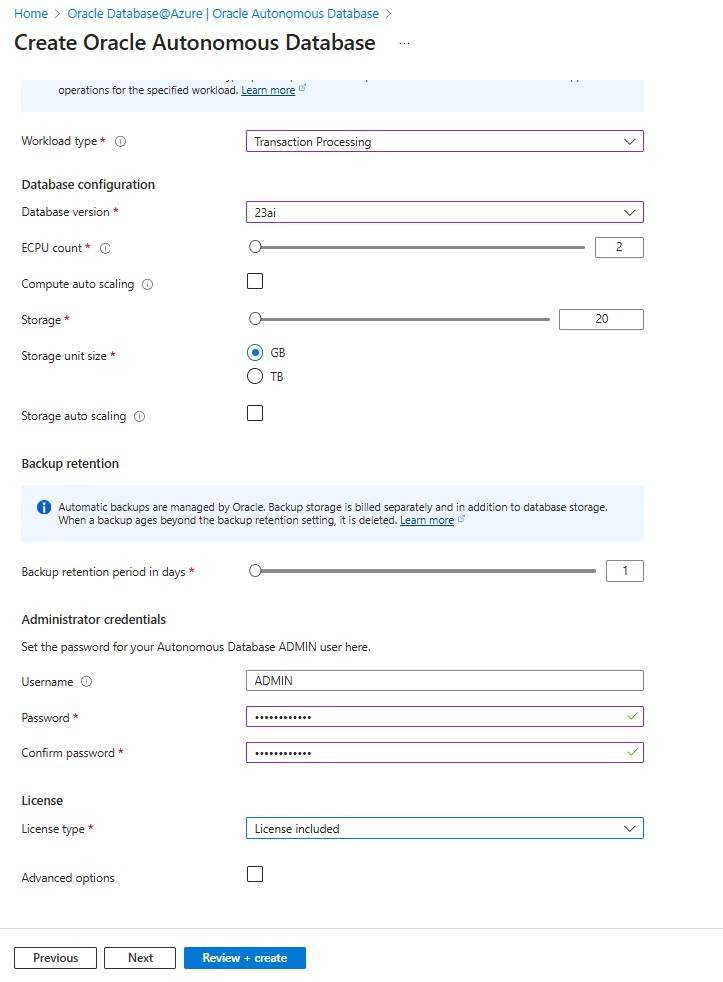

### Network Setting

1.  Choose for the connectivity the Access type: Managed private virtual network IP only

### Final Summary of the ADB Shared Settings

Review the final summary and click "Create".

### Deployment finished

The deployment will take between 10 to 15 minutes.

After the deployment is finished, you see the overview page of your newly created Autonomous Database.

### Further Reading

Complete documentation is available under the following links.

[Oracle Documentation: Create an Autonomous Database](https://docs.oracle.com/en-us/iaas/Content/database-at-azure/azucr-create-autonomous-database.html)

## **IMPORTANT: While You Are Waiting for the ADB Creation**

You will need the Microhack GitHub repository in the following challenges. Please clone the repository to your local machine if you have not done so yet.

Follow the instructions in the [Clone Partial Repository](../../docs/clone-partial-repo.md) document to clone only the required folder for this Microhack.

## Check the Created ADB in OCI Console

After the ADB was deployed successfully, check if the ADB is visible on the Azure Portal and OCI side. Important to mention on the OCI side is that the region is set to ***France Central*** and the Compartment is chosen properly.

For Oracle Database@Azure, the OCI console is mainly needed for “Oracle-side” lifecycle and integration tasks that still live in OCI, not in the Azure portal:

Tenant / identity / policy management

Managing OCI tenancy, compartments, IAM policies, and user access that relate to the Oracle-managed parts of the service.
Networking and integration on the OCI side

Viewing and managing OCI VCNs, subnets, NSGs/Security Lists, and routes that participate in the private dark‑fiber connectivity with Azure.
Advanced Oracle platform services

Using OCI-native services that integrate with Oracle Database@Azure (e.g., GoldenGate, Data Guard configurations that are exposed via OCI, logging/monitoring integrations).
Support, diagnostics, and observability

Accessing OCI-native logs, metrics, events, and support tools when Oracle asks you to verify or adjust something from the OCI side.

In short: day‑to‑day database and app operations happen in Azure and the Azure portal; the OCI console is needed when you touch the underlying Oracle/OCI tenancy, networking, or advanced Oracle platform services that sit “behind” Oracle Database@Azure.

To access the OCI console, use the following link after you are logged in to the Azure portal under your newly created ODAA Autonomous Database resource:

At the OCI console login page, select the "Entra ID" link:

You will land on the Oracle ADB databases overview page:

<!-- The compartment structure in OCI looks like:
~~~text
-- Root compartment - cptazure
   -- OCI Multicloudlink_ODBAA <number>
      -- Compartment <number>
~~~

 

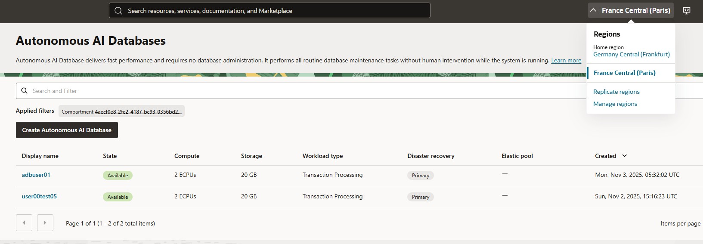
 -->

## Check the Existing VNet Peering

To save time to focus on the ODAA service itself, the VNet peering between both subscriptions is already available and can be verified. Here you have to switch to the resource group aks-user[assigned number]. Under the section Settings, you find the menu point Peering. Open the peering and check if the peering sync status and peering state are active.

The check of the VNet peering can be done from the ODAA side as well.

---

## Tips and Tricks

### How to Control What Can Be Deployed with Azure Policies and RBAC

Oracle Database@Azure does introduce new built-in RBAC Roles to help you manage access to Oracle Database@Azure resources. These roles can be assigned to users, groups, or service principals to control who can perform specific actions on Oracle Database@Azure resources. An overview of the different Azure RBAC roles can be found here: [Oracle documentation on RBAC roles](https://docs.oracle.com/en-us/iaas/Content/database-at-azure/onboard-access-control.htm)

In case you consider using Azure Policies to restrict what can be deployed, Azure Policy only accepts resource fields that have published aliases.

Oracle Database@Azure ADB doesn’t currently expose aliases for dataStorageSizeInGbs, backupRetentionPeriodInDays, isAutoScalingEnabled, isAutoScalingForStorageEnabled, licenseModel, or computeCount, so the service rejects any policy trying to evaluate them (InvalidPolicyAlias).

Currently you can only restrict the locations.

[Back to workspace README](../../README.md)