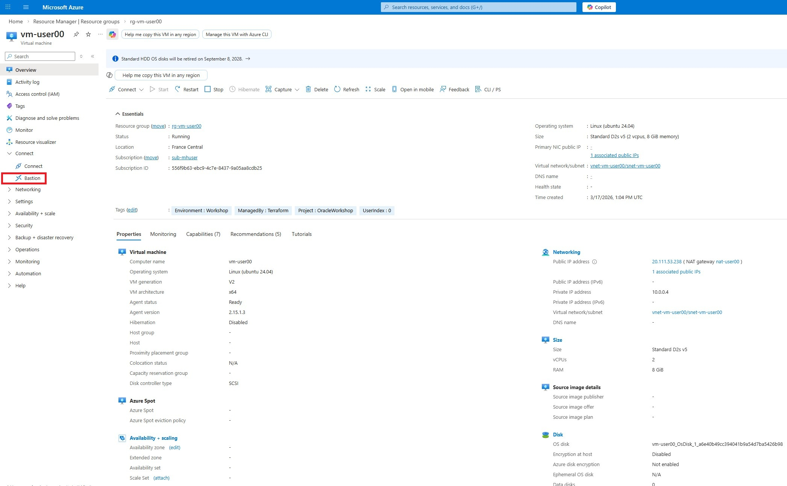
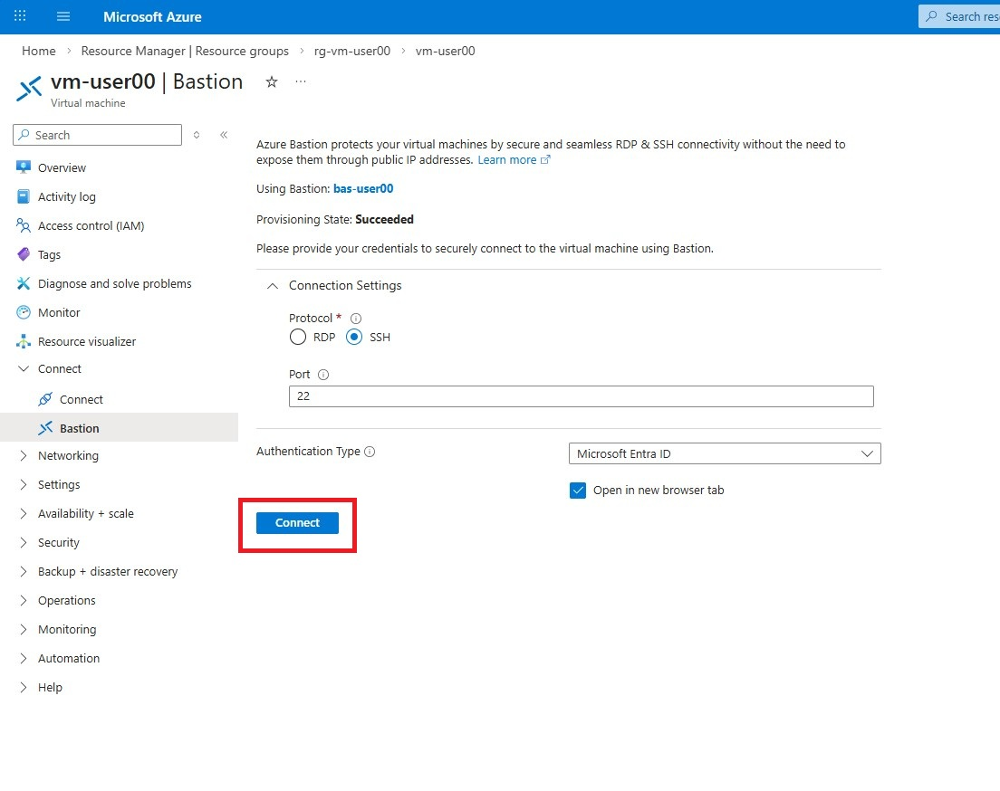
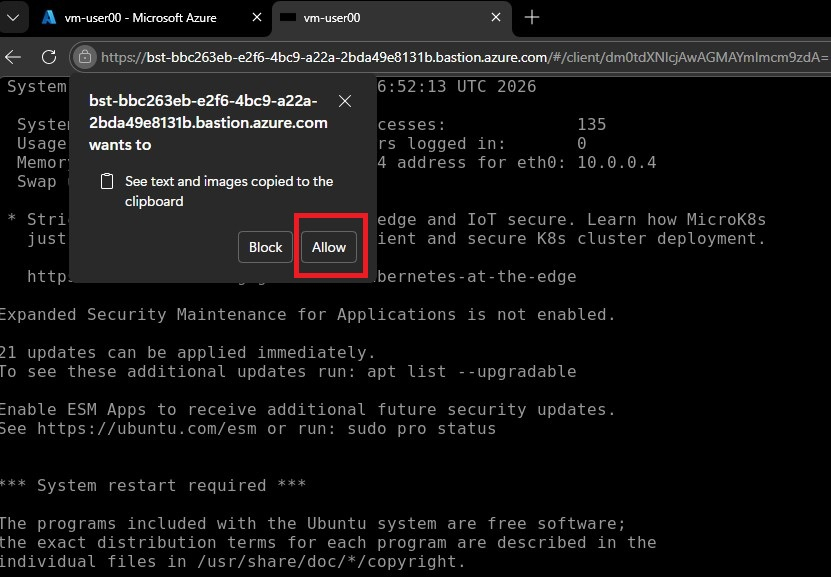
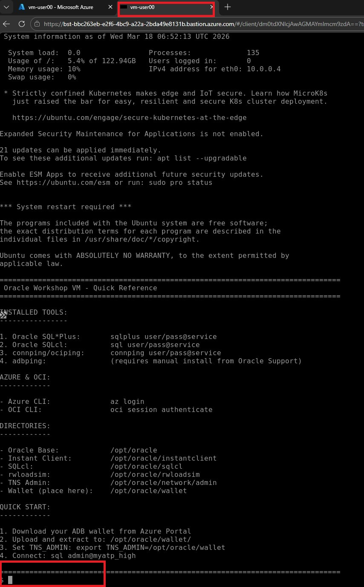

# 🔌 Challenge: Perform Connectivity Tests on Oracle Database@azure [ODAA] Autonomous Database

[Back to workspace README](../../README.md)

ODAA Autonomous Database are so called PaaS (Platform as a Service) offerings, where the underlying infrastructure is fully managed by Microsoft and Oracle.

Installing tools like iperf, sockperf, etc is not possible on the ODAA ADB instance itself, as you would do it on a VM or Bare Metal server.

The following exercise will use the oracle instant client running inside your Azure Virtual Machine to perform connectivity and performance tests towards the ODAA ADB instance. We will use the `adbping` and `connping` tools provided by Oracle for this purpose.

> [!NOTE]
> **adbping** requires manual installation. The Virtual Machine image includes only a placeholder script. To install the actual binary, download it from [Oracle Support (Doc ID 2863450.1)](https://support.oracle.com/support/?kmContentId=2863450), upload the zip to the Virtual Machine, extract it to `/opt/oracle/adbping`, and run:
> ```bash
> sudo ln -sf /opt/oracle/adbping/adbping /usr/local/bin/adbping
> ```

## Get your Azure Virtual Machine Public IP

### Search for Virtual Machines via the Azure Portal


### Select your Virtual Machine

Select the vm called "vm-user<USER-NUMBER>" (ex: vm-user02) 


Select the "Bastion" under the menue "Connect"




Keep the default settings on the Bastion and press the connect button.



The first time select the "Allow" button to open the connection to the Virtual Machine.



The connection should be successfully realized in a new opened browser tab.



### Copy the TNS of your ADB


### execute connping

~~~bash
# Set the password of your ADB (replace with your actual password)
pw="<YOUR-ADB-PASSWORD>"
# Use the TNS connection string obtained from Azure Portal (replace with your actual connection string)
trgConn="(description= (retry_count=20)(retry_delay=3)(address=(protocol=tcps)(port=1521)(host=<YOUR-HOST>.adb.eu-paris-1.oraclecloud.com))(connect_data=(service_name=<YOUR-SERVICE-NAME>_high.adb.oraclecloud.com))(security=(ssl_server_dn_match=no)))"
echo $trgConn
connping -l admin/$pw@"$trgConn" --period=30
exit
~~~

---

[Back to workspace README](../../README.md)