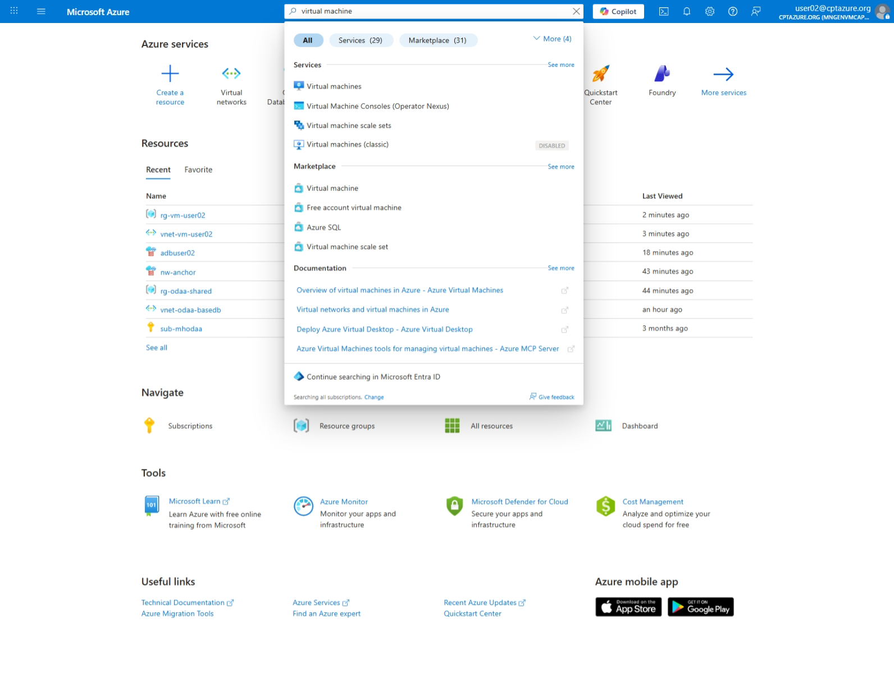
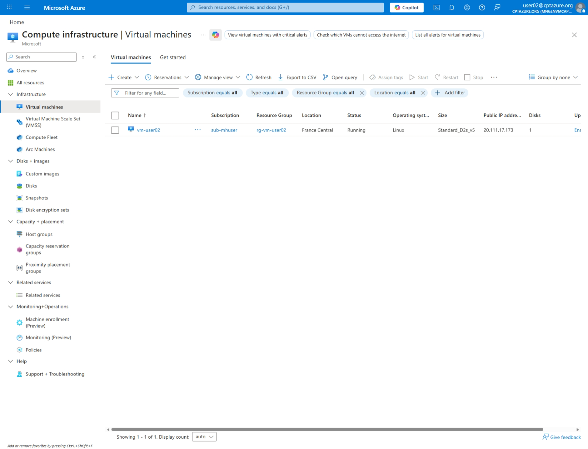
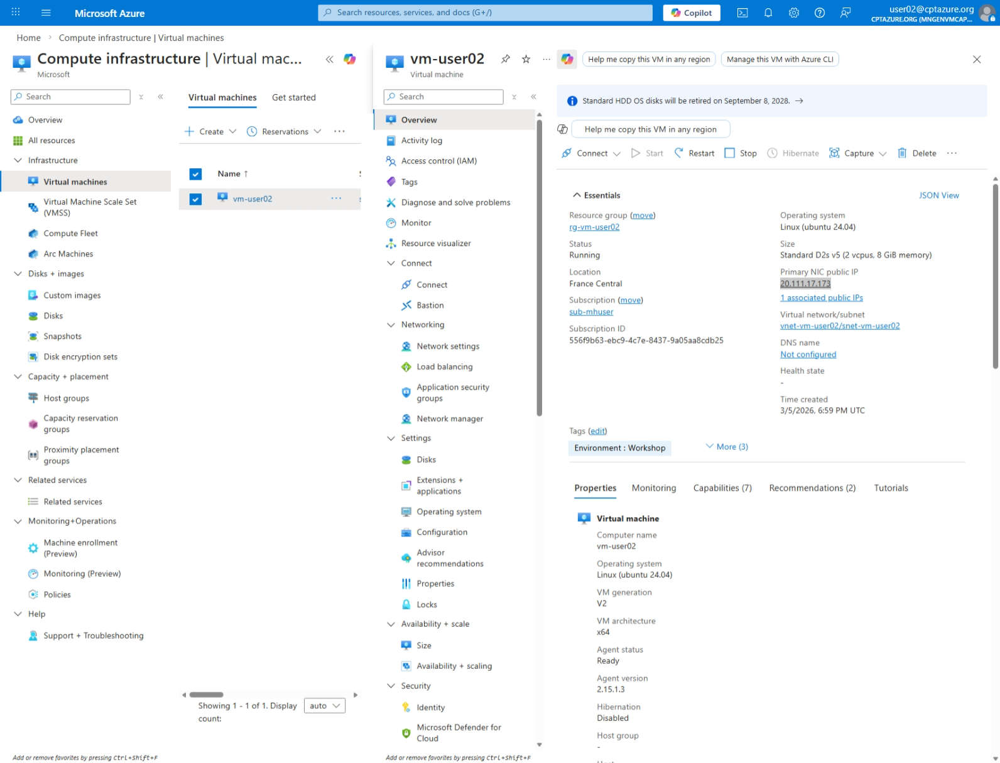
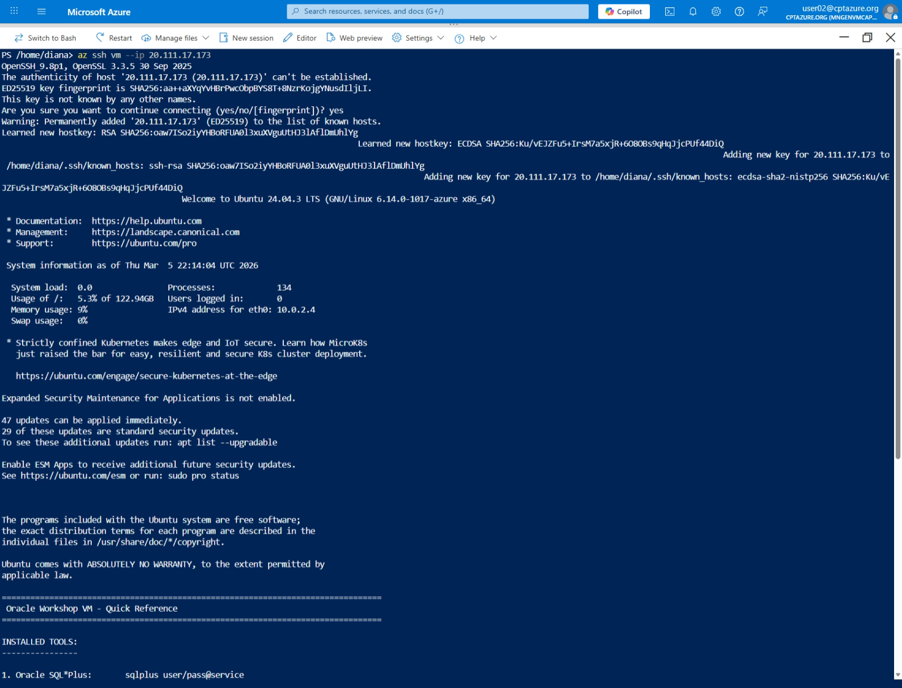
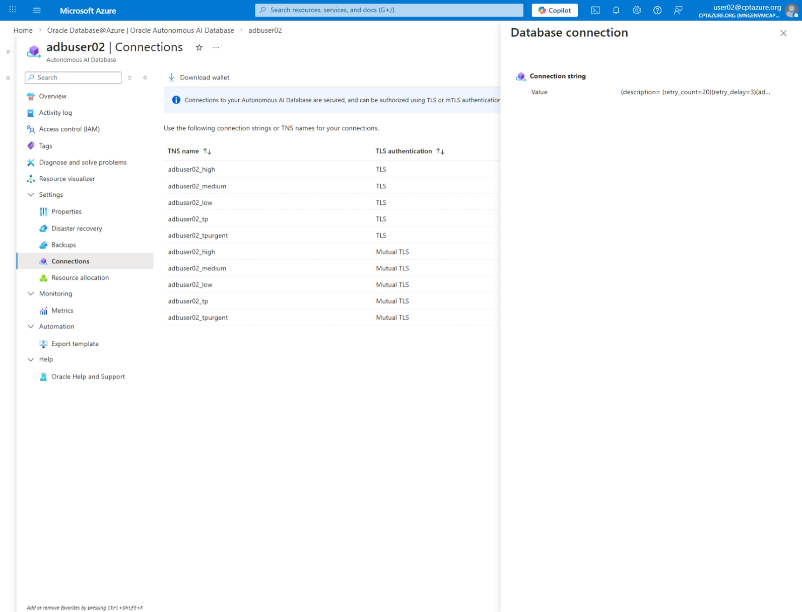

# 🔌 Challenge: Perform Connectivity Tests on Oracle Database@azure [ODAA] Autonoumous Database

[Back to workspace README](../../README.md)

ODAA Autonoumous Database are so called PaaS (Platform as a Service) offerings, where the underlying infrastructure is fully managed by Microsoft and Oracle.

Installing tools like iperf, sockperf, etc is not possible on the ODAA ADB instance itself, as you would do it on a VM or Bare Metal server.

The following exercise will use the oracle instant client running inside your Azure Virtual Machine to perform connectivity and performance tests towards the ODAA ADB instance. We will use the `adbping` and `connping` tools provided by Oracle for this purpose.

## Get your Azure Virtual Machine Public IP

### Search for Virtual Machines via the Azure Portal

### Select your Virtual Machine

Select the vm called "vm-user<USER-NUMBER>" (ex: vm-user02) 

Note down the public IP address. You will need it to connect to your VM and run the performance tests.

### 🔐 Login to Azure and set the right subscription

~~~powershell
# login to VM
az ssh vm --ip 20.111.17.173
~~~

### Copy the TNS of your ADB

### execute tnsping

~~~bash
# Set the password of your ADB
pw="Passw0rd1234"
# Use the TNS connection string obtained from azure portal
trgConn="(description= (retry_count=20)(retry_delay=3)(address=(protocol=tcps)(port=1521)(host=hyqmvoin.adb.eu-paris-1.oraclecloud.com))(connect_data=(service_name=gc2401553d1c7ab_adbuser02_high.adb.oraclecloud.com))(security=(ssl_server_dn_match=no)))"
echo $trgConn
connping -l admin/$pw@"$trgConn" --period=30
exit
~~~

---

[Back to workspace README](../../README.md)