#  Challenge: Update Oracle ADB NSG and DNS Configuration

[Back to workspace README](../../README.md)

##  Network Security Group Configuration

You need to update the Oracle ADB Network Security Group (NSG) with the CIDR range of the VNet where your Virtual Machine is deployed. This can be done via the Azure Portal.

See the [official Oracle documentation about Network Security Groups](https://docs.oracle.com/en-us/iaas/Content/Network/Concepts/nsg-manage.htm) for more details about Oracle NSG.

### Find the CIDR of your VM virtual network
Search for "Virtual Network" in the Azure portal.

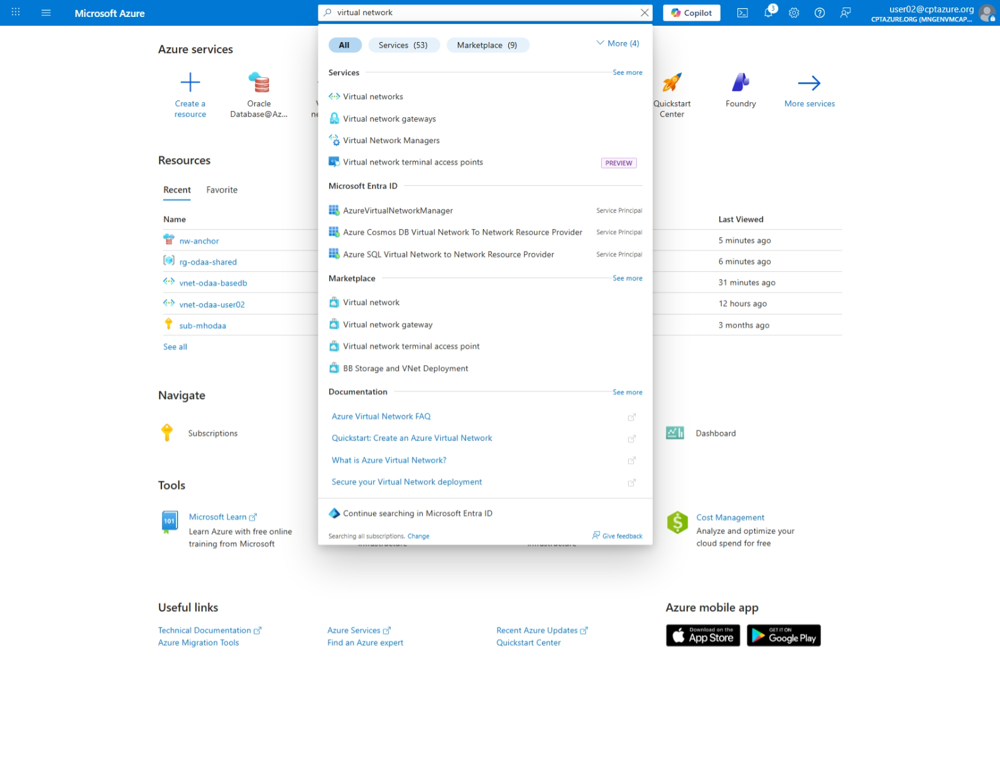

### Select your virtual network
Select the virtual network called "vnet-vm-user<USER-NUMBER>".

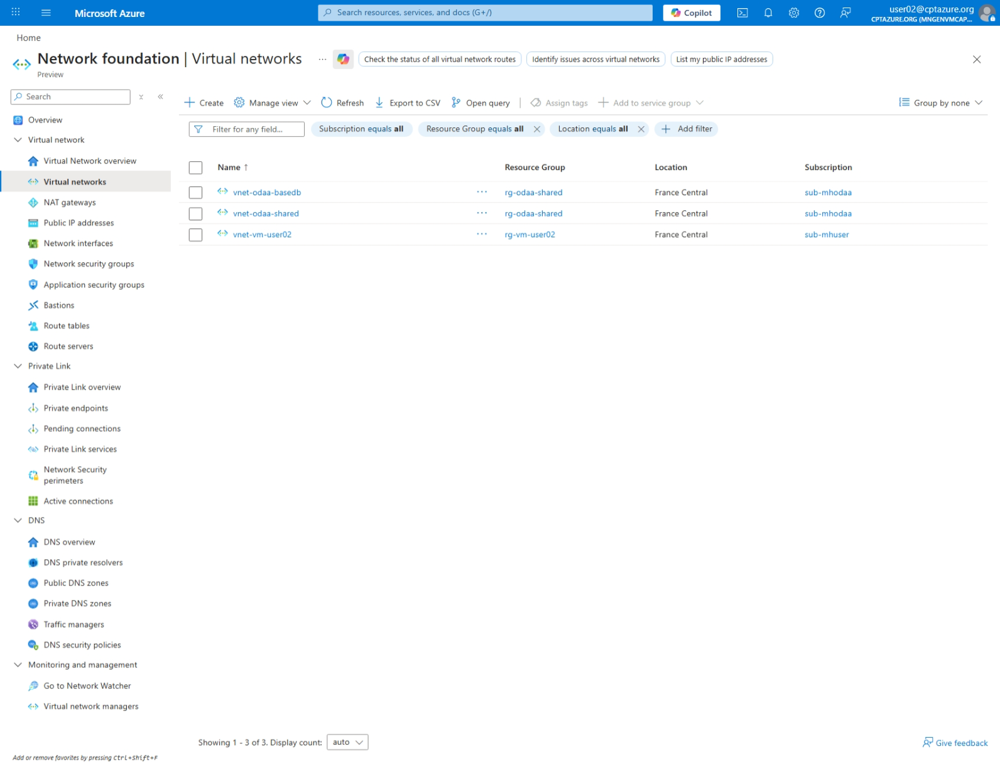

Inside the virtual network overview, copy the address space CIDR range
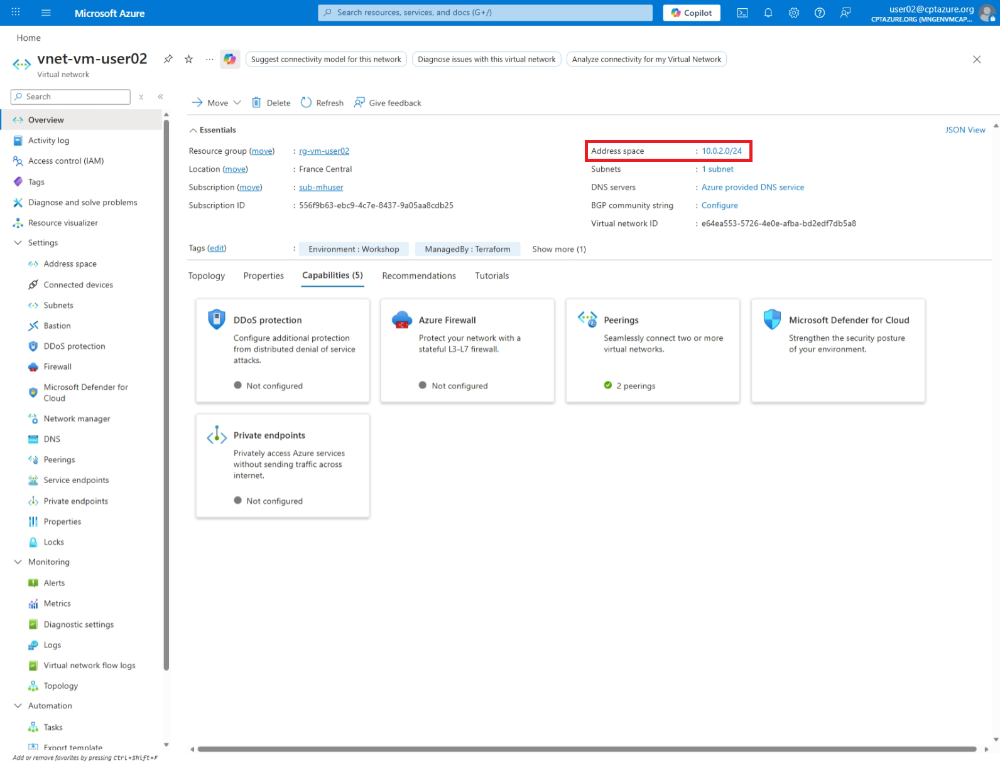

Now head over to your newly created ODAA Autonomous Database resource and click on the OCI Database URL link called "Go to OCI":
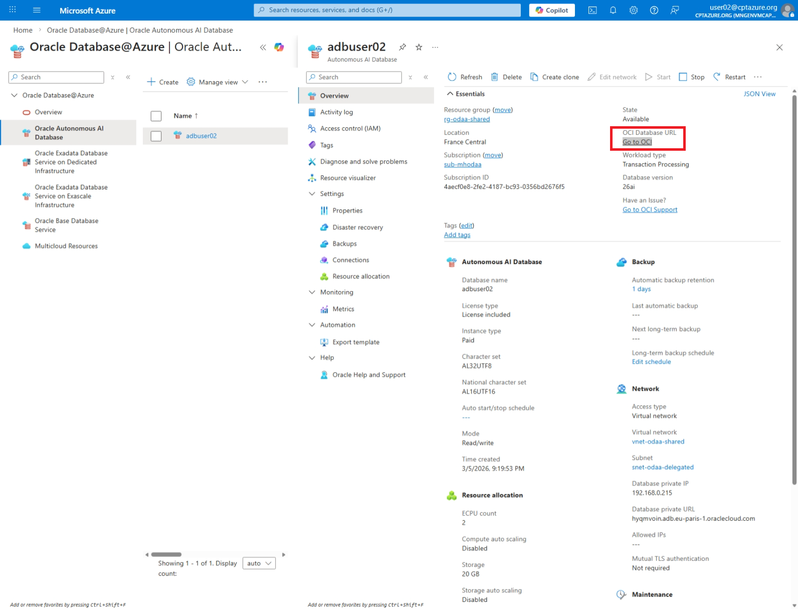

At the OCI console login page, select the "Entra ID" link:
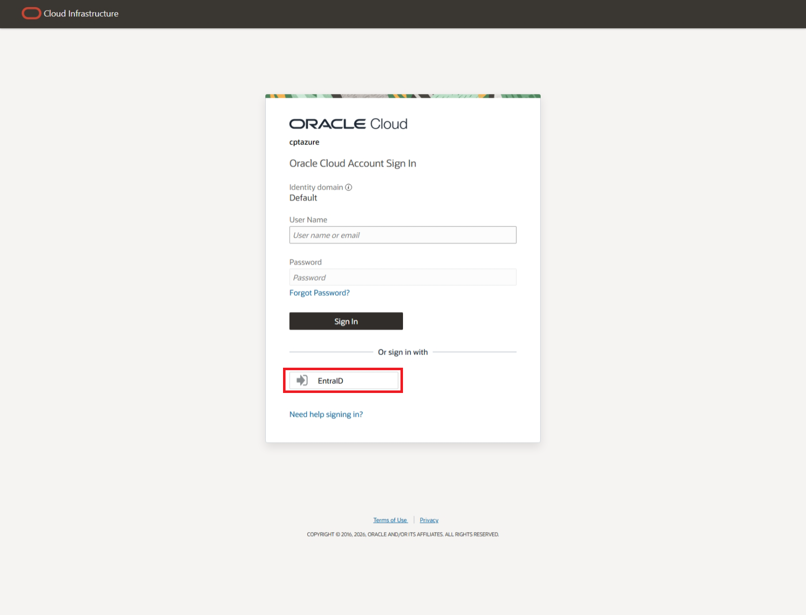

You will land on the Oracle ADB databases overview page:
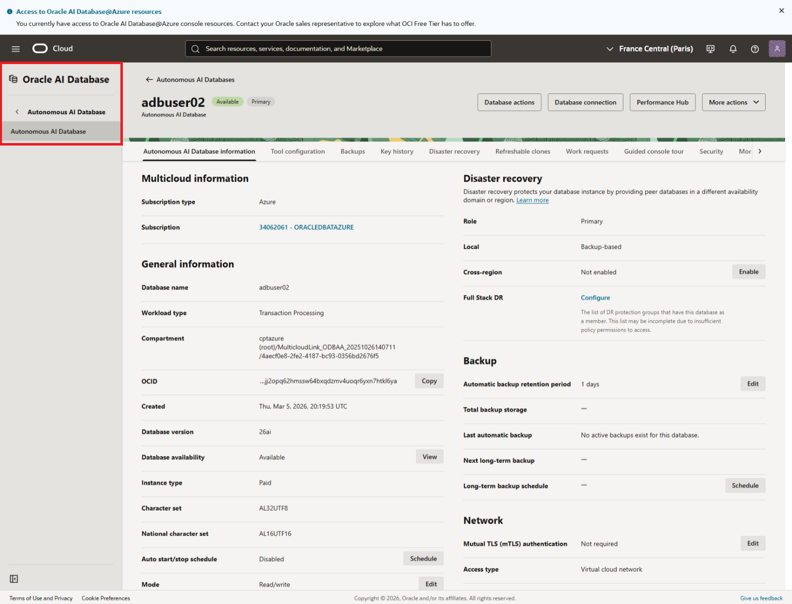

### Scroll down to the networking section on the ADB homepage.

Press on the link "Network Security Groups" to reach the NSG page.

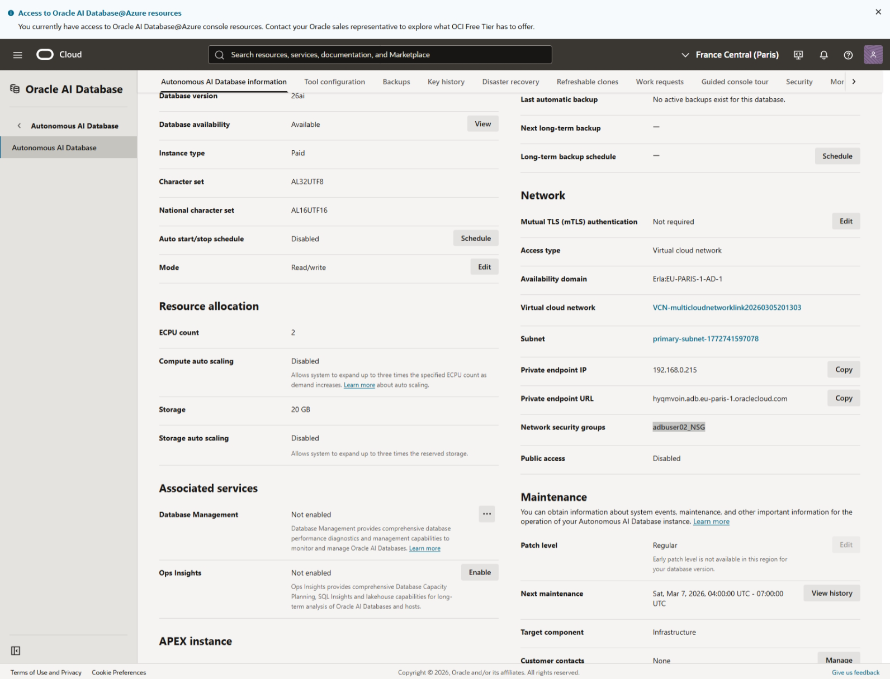

### Create NSG Rule
 Under the Tab "Security Rules", press the "Add Rules" button to add an ingress rule.
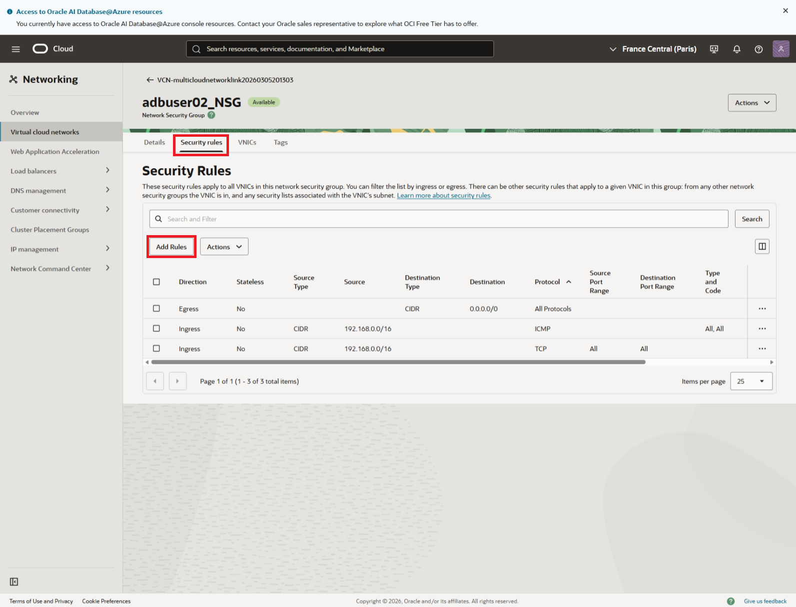

Choose in the Rule as "Source Type" CIDR and add the copied VNet address space of the previous "vnet-vm-user<USER-NUMBER>" into the field. Finally, click the "Add" button to create the rule.
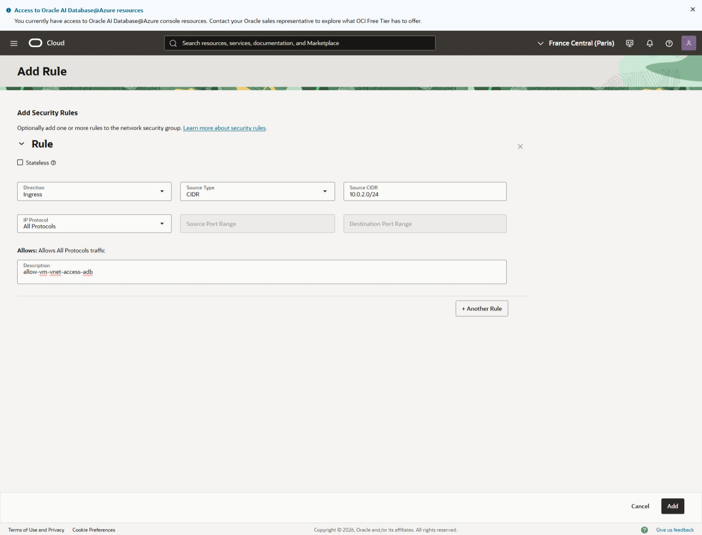

### Add a new private DNS zones A-Record for the ADB database

From the overview portal of the deployed ADB database, copy the FQDN of the "database private url" and Database private IP address both in the section Network.

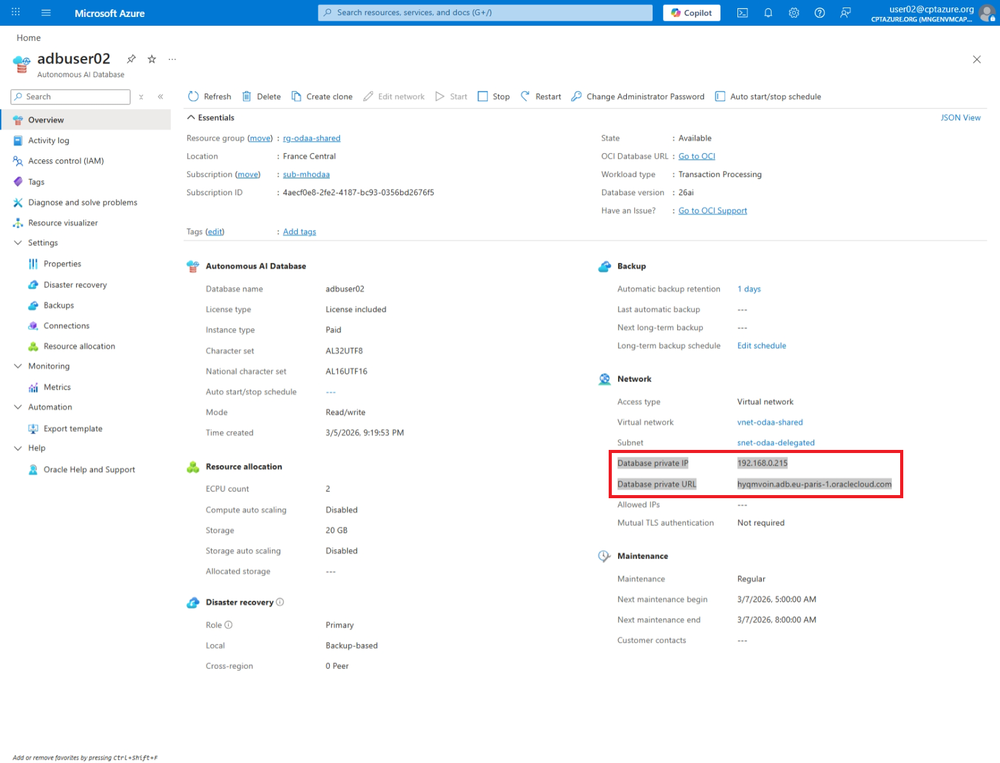

### Move to the resource group rg-vm-userXX

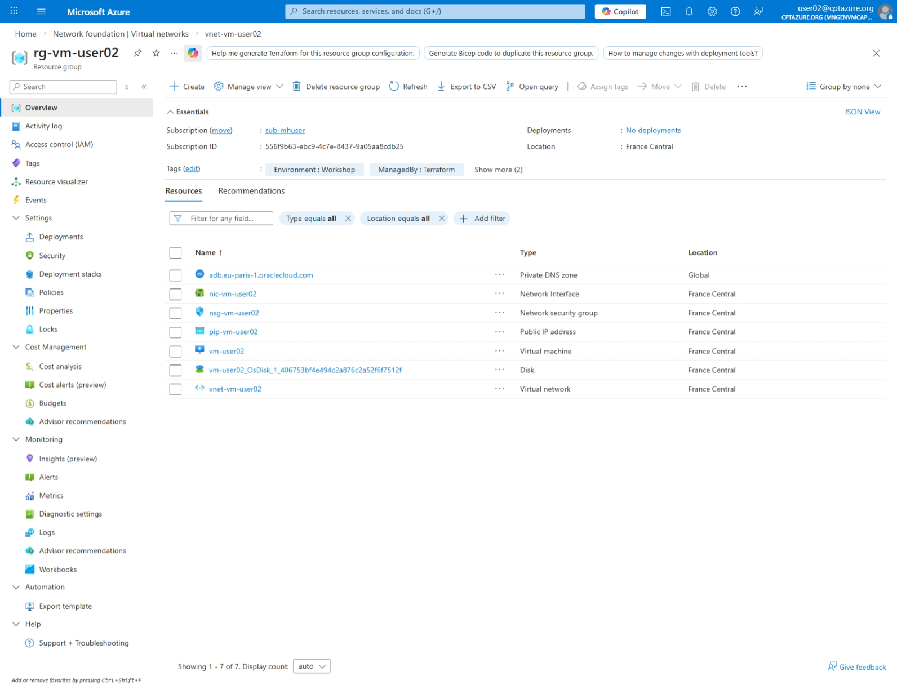

### Set private DNS 

Add a new DNS A-Records at the existing private DNS "adb.eu-paris-1.oraclecloud.com"

Configure the **Recordsets** as following.

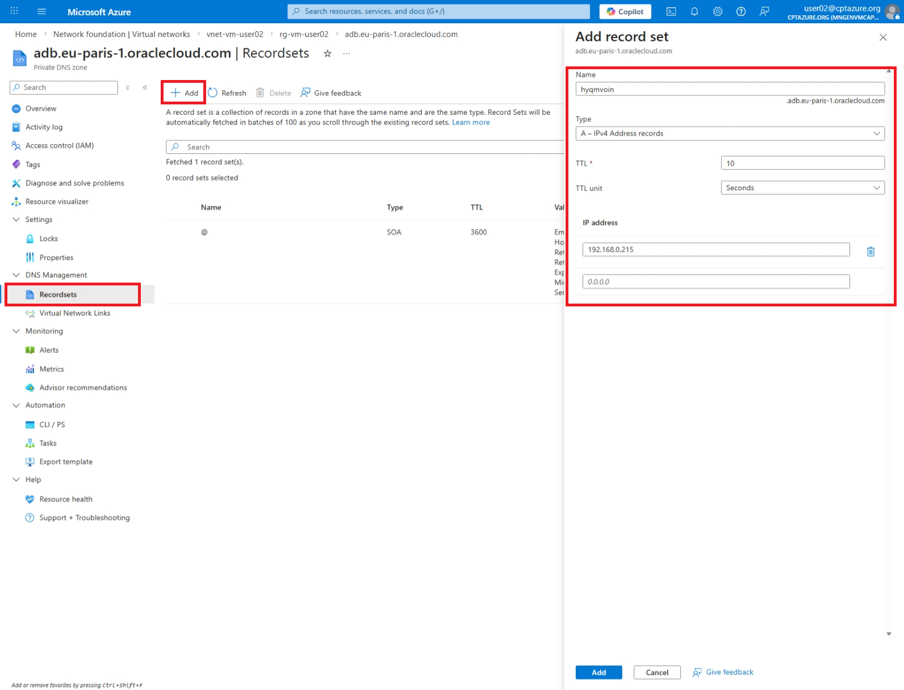

---

[Back to workspace README](../../README.md)